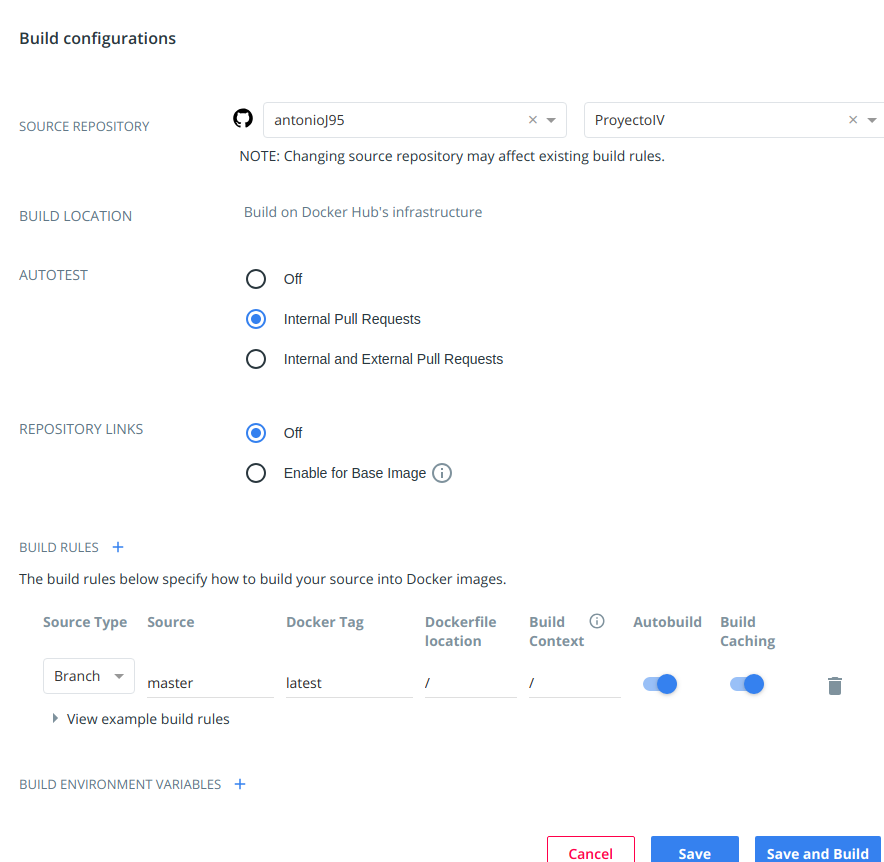
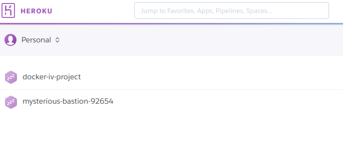
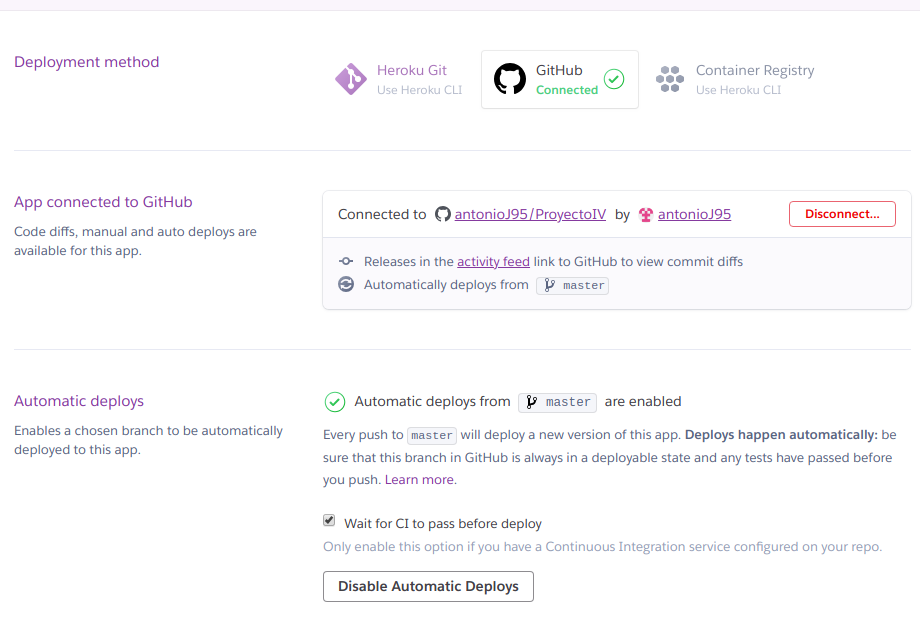
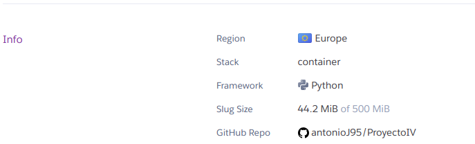
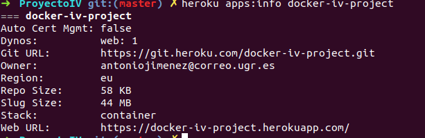

# ProyectoIV

### Despliegue 

*  Enlace al despliegue provisional:[Despliegue](https://mysterious-bastion-92654.herokuapp.com/)

El despliegue lo hemos realizado usando Heroku ya que nos aporta integración con GitHub y Travis facilitandonos así la integración continua.

Para ello hemos tenido que registrarnos en la web de Heroku, una vez registrados con la cuenta de correo de GitHub nos permite buscar nuestro repositorio de GitHub para así vincularlo.

En el apartado de Deploy podemos seleccionar la opción de desplegar automáticamente para poder permitir que cada push al proyecto en la rama elegida, en mi caso la master, haga que se implemente una nueva versión.

Importante seleccionar la casilla para que espere a los test de travis antes de realizar esto.

Aparte de añadir un **archivo Procfile** con el que especificaremos los comandos que serán ejecutados por los dynos de Heroku.
En el añadiremos una linea indicando que para el proceso web se aplique el comando gunicorn application:app

Para comprobar el funcionamiento podemos realizar diversas operaciones como:
- Obtener el valor de un dato: [/getInfoDato/idobjeto1](https://mysterious-bastion-92654.herokuapp.com/getInfoDato/idobjeto1).
> Añadiendo en la url /getInfoDato/el_id_objeto_dato nos muestra todos los elementos que componen ese dato junto a su información

- Obtener una posición específica y sus actividades relacionadas: [/searchP/Pos1](https://mysterious-bastion-92654.herokuapp.com/searchP/Pos1).
> Añadiendo en la url /searchP/el_id_de_la_posición nos muestra los datos que componen esa posición junto a los ids de las actividades que se relacionan con esta posición

- Obtener una actividad específica y sus posiciones relacionadas: [/searchA/Act1](https://mysterious-bastion-92654.herokuapp.com/searchA/Act1).
> Añadiendo en la url /searchA/actividad nos muestra los datos que componen esa actividad junto a los ids de las posiciones que se relacionan con esta actividad

### Despliegue en contenedor 

Enlace a [DockerHub](https://hub.docker.com/r/ajimenez95/projectiv)

#### Dockerfile:
Con el Dockerfile estamos indicando tanto la imagen base que utilizaremos para nuestro contenedor como las instrucciones necesarias para cubrir las necesidades de nuestra app.

En nuestro Dockerfile indicamos la imagen que usamos como base (python:3.6), indicamos los archivos que necesitamos copiar, que instale las dependencias que tenemos en requirements.txt y el comando de inicio a usar cuando inicie el contenedor.

La imagen base utilizada es la versión de python que tengo en mi ordenador, la cual incluye los paquetes necesarios para el funcionamiento de mi app y con la que tengo comprobado que funciona.

#### DockerHub
El repositorio de DockerHub está creado una vez nos hemos registrados en DockerHub y usando la opción de Create Automated Build.
Esta opción nos permite enlazar nuestra cuenta de Github y seleccionar nuestro repositorio del proyecto, para poder acceder al Dockerfile contenido en el, y crear así una imagen con cada push que realicemos a nuestro repositorio de Github.
Esta imagen se almacenará en este repositorio de DockerHub.

La configuración en el apartado builds de nuestro repositorio de DockerHub debe ser la siguiente:

Con esta cofiguración ya tendríamos asegurado que este repositorio de DockerHub esta enlazado con el nuestro de GitHub en el cual se encuentra nuestro proyecto y le tenemos indicada también donde está el dockerfile que debe de utilizar.

#### Heroku.yml y despliegue con contenedor:
[Documentación seguida](https://devcenter.heroku.com/articles/build-docker-images-heroku-yml)

Hemos creado otra app en heroku para desplegar la usando contenedores.

Para que nuestra nueva app de heroku construya una imagen docker añadimos el heroku.yml, donde le indicamos en la parte de build que usaremos el Dockerfile que se encuentra en este directorio y en la parte de run la orden que debe de ejecutar para lanzar la app.
En el heroku.yml en caso de no indicar ninguna orden para la ejecución en la sección run se utiliza la especificada en la parte de CMD del Dockerfile.

Nuestra nueva app esta conectada también con nuestro repositorio de GitHub de la siguiente forma:

Pero para que heroku utilice el heoroku.yml en lugar del procfile, debemos de indicárselo desde terminal usando el heroku cli.

Esto se realiza usando el siguiente comando:
~~~
heroku stack:set container
~~~
Con esto le indicamos a Heroku que el desliegue de la app  se realizará usando contenedores y pillando así el heroku.yml.

Podemos ver que esto se ha realizado correctamente en la información de nuestra nueva app desde el dashboard de Heroku:

O desde nuestro ordenador usando el comando:
~~~
heroku apps:info docker-iv-project
~~~

Donde en ambas partes vemos que en Stack pone container.

### Despliegue en IaaS:
Este último hito consiste en realizar un despliegue automático en un IaaS, en mi caso será usando Google Compute Engine de Google Cloud.
Para ello nos hemos creado una cuenta y utilizado el proyecto que viene creado por defecto, My First Proyect.

Una vez encontrándonos dentro de Google Cloud debemos entrar a la parte de Compute Engine, que nos permite crear las IaaS necesarias.
Para obtener credenciales necesarios para operar con el proyecto, debemos de crearnos una cuenta de servicio nueva asociada al proyecto y descargarnos la clave.
También debemos de obtener el correo relacionado a este servicio.
Ya tenemos un proyecto en google compute engine y la clave para poder tener acceso a las IaaS.
Ahora debemos de darnos acceso ssh, por lo que creamos una clave ssh con ssh-keygen y la subimos a GCE.
Por lo que pasamos a la configuración del vagrantfile para configurar las IaaS.

Para ello empezamos por instalar el [plugin](https://github.com/mitchellh/vagrant-google) desarrollado para vagrant el cual permite controlar y provisionar instancias de GCE. Los pasos de configuración básica son seguidos del propio tutorial que nos proporcionan.

Los pasos seguidos para configurar el [vagrantfile](https://github.com/antonioJ95/ProyectoIV/blob/master/Vagrantfile) han sido:
 - la indicación de la versión de vagrant utilizada, la 2.
 - Indicación el uso de la dummy box de google.
 - Empezamos con la configuración específica para google como proveedor:
   - Usamos los credenciales obtenidos antes para la autenticación de google.
   - Indicamos la imagen de la cual se tenga que bajar la versión más reciente.
   - Indicamos el tipo de máquina que vamos a utilizar, en nuestro caso la n1-standard-1 (1 vCPU, 3,75 GB)
   - Nombre de la instancia.
   - Zona donde se creará la instancia.
   - Tag ['http-server'](https://cloud.google.com/vpc/docs/add-remove-network-tags) con el que permitimos las conexiones http por el puerto 80 para nuestra instancia.
   - Usamos nuestros credenciales para la configuración ssh.
 - Configuración de ansible como el encargado de provisionar nuestra instancia:
 - En este apartado configuramos ansible permitiendo modo root, indicando donde se cuentra el script de provisionamiento y el nivel de detalle a mostrar con la ejecución.

Una vez hecho esto podemos pasar a la configuración de ansible en nuestro fichero [playbook.yml](https://github.com/antonioJ95/ProyectoIV/blob/master/provision/playbook.yml).

Con este fichero vamos a indicar la configuración necesaria para el correcto funcionamiento de la instancia para permitir desplegar nuestra aplicación.

Para ello instalamos primero git y pip3.
Luego pasamos a clonar el repositorio en la carpeta ProyectoIV.
Por último instalamos el archivo requirements con pip3 asegurando con esto que tenemso todos los recursos necesario para el despliegue de nuestra aplicación.

Por último llegamos a la parte de realizar el despliegue de la aplicación y para ello vamos a utilizar flightplan.
Con nuestro archivo [flightplan.js](https://github.com/antonioJ95/ProyectoIV/blob/master/despliegue/flightplan.js) vamos a indicar los comandos a ser realizados tanto en la instancia como en nuestro local para el despliegue y control de la aplicación.

Para usar flightplan que se trata de una biblioteca de node.js tenemso que tener instalado como es lógico node, npm y con este instalar flightplan.

Lo primero a realizar en el archivo es incluir esta librería, luego pasamos a identificar el que será el objetivo (host) que se verá afectado por los comandos.
Para ello basta con indicar su ip externa, el usuario con el que nos identificamos e indicarle con la variable de entorno la autenticación ssh. Esta variable usa las claves que se encuentran en ~/.ssh/ por lo que es necesario no haber movido las claves generadas de ahí.

Ahora pasamos a definir las ordene:
 - Orden exec: En este caso la orden la ejecutamos como es lógico usando remote, y le indicamos que encontrandose en la carpeta del proyecto utilice gunicorn para desplegar y mande la salida tanto de error como estándar a un fichero para poder tener un log de esto.
 - Orden kill: Orden ejecutada en remoto para acabar el despliegue haciendo uso de la orden kill.
 - Orden logs: Orden ejecutada en local para obtener los archivos que se encuentren en tmp, donde guardamos el log.

 Para esta última orden antes he tenido que descargar gcloud en local para que pudiese funcionar correctamente.

## Licencia

## Tests
